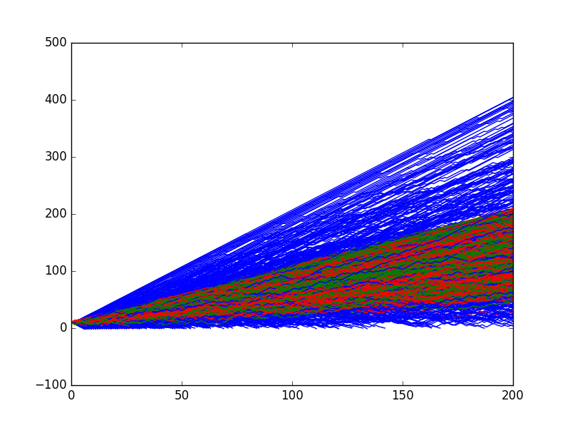

# Prisoner's dilema with trust.

Prisoners have a common pool of trust. They gauge its level as part of
the decision process with which they choose to cooperate or defect.

One thousand simulations of two hundred time steps are run and plotted.

## Run it

You might want to install the required libraries. Perhaps within a [virtualenv](http://virtualenv.org) do:

    $ pip install -r requirements.txt

Each simulation has a python script which handles de runs and
plotting, the pd_trust library implements agent logic. Run them thusly:

    $ ./run_all.sh

## Tit for tat

Agents do onto their acomplice as their acomplice did to them in the
prior time step.

# Proportional Tit for Tat

Agents do onto their acomplice as their acomplice in average did to them in all prior time steps.

# altruist_differential_fitness

# selfish_memory

# different_memories_tit_for_tat

# selfish_perfect_memory

# proportional_tit_for_tat

# tit_for_tat

# random_strategy

